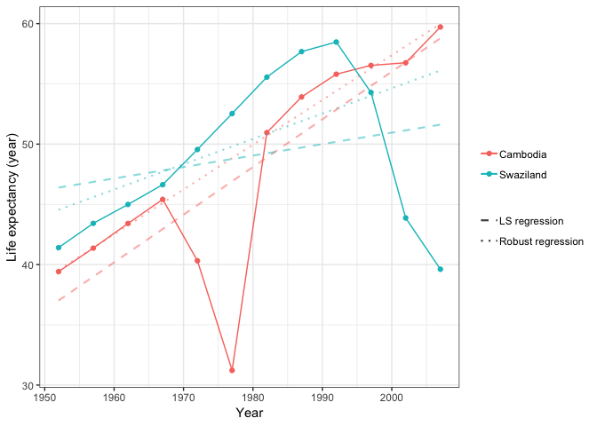

Homework 06: Data wrangling wrap up
================
Roger Yu-Hsiang Lo
2018-11-09

-   [Load packages](#load-packages)
-   [2. Writing functions](#writing-functions)
-   [6. Work with a nested data frame](#work-with-a-nested-data-frame)

Load packages
-------------

``` r
library(gapminder)
library(tidyverse)
library(broom)
library(scales)  # For adding $ sign to scales
library(MASS)  # For various regression functions
library(randomForest)  # For fitting random forest models
library(rpart)  # For tree models
```

2. Writing functions
--------------------

Looking at the following scatter plot between GDP per capita and life expectancy for each continent in 2007, we might ask, if we have a data point with, say, GDP per capita of $10,000 and life expectancy of 75, which continent would we expect that data point to be from?

``` r
gapminder %>%
  filter(year == 2007) %>%
  ggplot(aes(x = lifeExp, y = gdpPercap, color = continent)) +
  theme_bw() +
  geom_point() +
  scale_y_continuous(labels = dollar_format(prefix = "$")) +
  labs(x = "Life expectancy (year)", y = "GDP per capita") +
  theme(legend.title = element_blank())
```


To tackle this task, we have several options. Here I will use linear discriminant analysis, or LDA. To see how this LDA model will make predictions for new data points, let us first generate a grid of fine data points and plot the predicted values for these points, along with the original data.

``` r
dat <- gapminder %>% filter(year == 2007)

LDA <- lda(continent ~ lifeExp + gdpPercap, data = dat)

# Generate grid of new data points
lifeExp <- seq(min(dat$lifeExp), max(dat$lifeExp), length=200)
gdpPercap <- seq(min(dat$gdpPercap), max(dat$gdpPercap), length=200)
new <- expand.grid(lifeExp, gdpPercap)
names(new) <- c('lifeExp', 'gdpPercap')

# Make predications for the new data
new$pred_LDA <- predict(LDA, newdata = new)$class

new %>%
  ggplot(aes(x = lifeExp, y = gdpPercap, color = pred_LDA)) +
  theme_bw() +
  geom_point(alpha = 0.25, size = 0.5) +
  geom_point(aes(x = lifeExp, y = gdpPercap, color = continent), data = dat) +
  scale_y_continuous(labels = dollar_format(prefix = "$")) +
  labs(x = "Life expectancy (year)", y = "GDP per capita") +
  theme(legend.title = element_blank())
```


We can see from the plot that this LDA classifier would predict the data of low life expectancy to be from Africa (although there are some Asian countries in this range as well) and the data of high life expectancy to be from Americas or Europe, depending on GDP per capita. Notice also that no predicted countries include the ones in Oceania. We would also expect this LDA classifier to make many mistakes, because clearly countries from different continents do not cluster neatly in the original data set.

The next question is then: Can we find another model that fits the data better? Let us try fitting a random forest model to our data and see how this model partitions the feature space:

``` r
rndmfrst <- randomForest(continent ~ lifeExp + gdpPercap, data = dat)
new$pred_rndmfrst <- predict(rndmfrst, newdata = new, type = "class")
new %>%
  ggplot(aes(x = lifeExp, y = gdpPercap, color = pred_rndmfrst)) +
  theme_bw() +
  geom_point(alpha = 0.25, size = 0.5) +
  scale_y_continuous(labels = dollar_format(prefix = "$")) +
  labs(x = "Life expectancy (year)", y = "GDP per capita") +
  theme(legend.title = element_blank()) +
  geom_point(aes(x = lifeExp, y = gdpPercap, color = continent), data = dat)
```


Looking at the plot, the random forest model partitions the feature space into regions that are rather different from the ones in LDA.

Here I try to write a (not so elegant) function that takes a (trained) model and returns a plot that shows how the feature space is partitioned:

``` r
partition <- function(model) {
  lifeExp <- seq(min(dat$lifeExp), max(dat$lifeExp), length=200)
  gdpPercap <- seq(min(dat$gdpPercap), max(dat$gdpPercap), length=200)
  new <- expand.grid(lifeExp, gdpPercap)
  names(new) <- c('lifeExp', 'gdpPercap')
  
  tryCatch({
    new$pred <- predict(model, newdata = new, type = "class")
    },
    error = function(e) {
      new$pred <<- predict(model, newdata = new)$class
    })
  
  dat <- gapminder %>% filter(year == 2007)
  
  new %>%
    ggplot(aes(x = lifeExp, y = gdpPercap, color = pred)) +
    theme_bw() +
    geom_point(alpha = 0.25, size = 0.5) +
    scale_y_continuous(labels = dollar_format(prefix = "$")) +
    labs(x = "Life expectancy (year)", y = "GDP per capita") +
    theme(legend.title = element_blank()) +
    geom_point(aes(x = lifeExp, y = gdpPercap, color = continent), data = dat)
}
```

We can test this function with a new model. Here I build a classification tree model:

``` r
tree <- rpart(continent ~ lifeExp + gdpPercap, data = dat)
partition(tree)
```


6. Work with a nested data frame
--------------------------------

In this task, I compare the intercepts and slops of an ordinary least-squares regression model and a robust regression model. Specifically, I regressed `lifeExp` on `year` for each `country` in both models. Then I compute the absolute value of the difference between the corresponding coefficients of the two models. If the difference between the corresponding coefficients is huge, it means that the using a linear model is not a good approximation.

``` r
# Create a data frame to store the coefficients of an linear LS model
gap_coefs_lm <- gapminder %>%
  group_by(continent, country) %>%
  nest() %>%
  mutate(fit_lm = map(data, .f = function(df) lm(lifeExp ~ I(year - 1952), data = df)),  # Use the value of 1952 as the intercept
         coefs_lm = map(fit_lm, .f = tidy)) %>%
  dplyr::select(continent, country, coefs_lm) %>%
  unnest(coefs_lm) %>%
  dplyr::select(continent:estimate) %>%
  mutate(term = recode(term,
                       `(Intercept)` = "intercept",
                       `I(year - 1952)` = "slope")) %>%
  spread(key = term, value = estimate)

# Create a data frame to store the coefficients of a linear robust regression model
gap_coefs_rlm <- gapminder %>%
  group_by(continent, country) %>%
  nest() %>%
  mutate(fit_rlm = map(data, .f = function(df) rlm(lifeExp ~ I(year - 1952), data = df)),
         coefs_rlm = map(fit_rlm, .f = tidy)) %>%
  dplyr::select(continent, country, coefs_rlm) %>%
  unnest(coefs_rlm) %>%
  dplyr::select(continent:estimate) %>%
  mutate(term = recode(term,
                       `(Intercept)` = "intercept",
                       `I(year - 1952)` = "slope")) %>%
  spread(key = term, value = estimate)

# Combine the two data frames
gap_coefs <- left_join(gap_coefs_lm, gap_coefs_rlm, by = c("continent", "country"))

gap_coefs <- gap_coefs %>%
  mutate(diff_int = abs(intercept.x - intercept.y),
         diff_slp = abs(slope.x - slope.y)) %>%
  dplyr::select(continent, country, diff_int, diff_slp)

# Check everything works...
gap_coefs %>%
  head() %>%
  knitr::kable()
```

| continent | country      |  diff\_int|  diff\_slp|
|:----------|:-------------|----------:|----------:|
| Africa    | Algeria      |  0.2169717|  0.0065516|
| Africa    | Angola       |  0.0082721|  0.0003085|
| Africa    | Benin        |  0.0000000|  0.0000000|
| Africa    | Botswana     |  0.0000000|  0.0000000|
| Africa    | Burkina Faso |  0.0000000|  0.0000000|
| Africa    | Burundi      |  0.0000000|  0.0000000|

Now we can visualize the data using a scatter plot.

``` r
gap_coefs %>%
  ggplot(aes(x = diff_int, y = diff_slp, color = continent, label = country)) +
  theme_bw() +
  geom_point() +
  geom_text(hjust = 0, nudge_x = 0.05, size = 3, check_overlap = TRUE) +
  labs(x = "Difference in intercept", y = "Difference in slope") +
  theme(legend.position = "none")
```


Here the countries that have the largest difference in intercept or slope are worth looking into: Swaziland and Cambodia.

``` r
gapminder %>%
  filter(country %in% c("Swaziland", "Cambodia")) %>%
  ggplot(aes(x = year, y = lifeExp, color = country, group = country)) +
  theme_bw() +
  geom_point() +
  geom_line() +
  labs(x = "Year", y = "Life expectancy (year)") +
  theme(legend.title = element_blank()) +
  stat_smooth(geom = "line", method = "lm", se = FALSE, aes(linetype = "LS regression"), alpha = 0.5, size = 0.75) +
  stat_smooth(geom = "line", method = rlm, se = FALSE, aes(linetype = "Robust regression"), alpha = 0.5, size = 0.75) +
  scale_linetype_manual(values = c("dashed", "dotted"))
```



From the following plot, we can see that there were some huge ups and downs in life expectancy over the years in these two countries --- which is why the two linear models give quite different coefficients.
